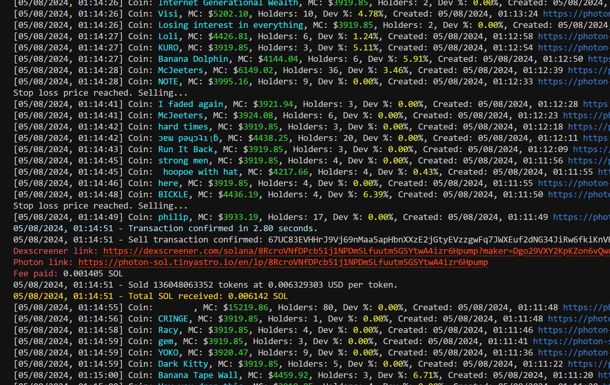

# Snipe-X Bot: The Ultimate Trading Tool for Pump.Fun Sniping

## Overview

Snipe-X Bot is an advanced, open-source trading bot specifically designed for Pump.Fun sniping. Built with security and speed in mind, this bot provides a plethora of customizable settings, making it the perfect tool for any trader aiming for success in the fast-paced world of Pump.Fun trading. Constant updated scans and analytics, makes Snipe-X Bot your go-to solution for automated trading.

## Key Features

### Security and Speed
- **Secure Transactions:** Built using the robust Solana Web3.js library.
- **Fast Execution:** High-speed transaction processing to stay ahead in the market.

### No Fees
- No extra fees & charges on transactions. Completly independent form other services. 

### Extensive Customization
- **Enhanced Functionality:** Allows you to see more information about each coin and buy them individually.
- **Position Persistence:** Automatically saves your positions and reloads them upon restart.
- **Auto Trading:** Enable or disable automated trading with a simple toggle.
- **Slippage Control:** Set your own buy and sell slippage percentages to minimize losses.
- **Gas Fee Management:** Customize gas fees in SOL for transactions.
- **Take Profit and Stop Loss:** Automate your trading strategy with configurable profit-taking and stop-loss percentages.
- **Market Cap Filtering:** Filter coins based on minimum and maximum USD market cap.
- **Social Media Filters:** Require coins to have a website, Twitter, or Telegram account for added credibility.
- **Developer Wallet Monitoring:** Avoid potential rug pulls by filtering coins based on developer wallet holdings and monitor developer sales.
- **Holders Count Filter:** Ensure coins have a minimum number of holders for added security.

### User-Friendly Interface
- **Inquirer Prompts:** Easy-to-use command-line prompts for setting preferences and executing trades.
- **Detailed Logs:** Comprehensive logging for all actions and transactions.

### Open Source
- **Transparency:** Full access to the bot's source code ensures transparency and trust.

### Future Updates
All paid users will grant access to all future updates.

### Screens




## User Guide

### Installation
1. **Clone the repository:** 
    ```bash
    git clone https://github.com/FinDevxyz/Snipe-X-Bot-Pump.fun.git
    cd Snipe-X-Bot-Pump.fun
    ```

2. **Install dependencies:**
    ```bash
    npm install
    ```

3. **Configure environment variables:**
    Create a `.env` file in the root directory and add your private key and custom RPC URL:
    ```env
    PRIVATE_KEY=your_private_key
    CUSTOM_RPC_URL=your_custom_rpc_url
    ```

### Running the Bot
1. **Start the bot:**
    ```bash
    node pump_fun.js
    ```

2. **Main Menu:**
    - **Purchase the latest coin:** Automatically buy the latest coins based on your settings.
    - **Purchase the King of the Hill coin:** Buy the top-performing coin.
    - **View the latest 10 coins:** Display and buy from a list of the latest coins.
    - **Purchase coin by contract address:** Manually enter a contract address to buy.
    - **View positions:** Monitor and manage your current positions.
    - **Set settings:** Customize your trading settings.
    - **Exit:** Exit the bot.

### Settings Configuration
Customize your settings via the `settings.json` file or through the interactive prompts in the bot. Key settings include:
- **auto:** Enable/disable auto trading.
- **buyAmount:** Set the amount of SOL to spend on each trade.
- **buySlippagePercentage/sellSlippagePercentage:** Control slippage to manage transaction costs.
- **gasFeeInSol:** Specify the gas fee for transactions.
- **takeProfitEnabled/takeProfitPercentage:** Enable and set profit-taking percentage.
- **stopLossEnabled/stopLossPercentage:** Enable and set stop-loss percentage.
- **min_usd_market_cap/max_usd_market_cap:** Set market cap filters.
- **require_website/require_twitter/require_telegram:** Require coins to have specific social media presence.
- **min_holders_count:** Set the minimum number of holders for a coin.
- **use_dev_wallet_filter/max_dev_wallet_holdings_percentage:** Enable developer wallet filtering and set the maximum allowed developer wallet holdings percentage.
- **scan_all_coins:** Choose to scan all coins or only newly released ones.

## Conclusion

Snipe-X Bot is the ultimate tool for traders looking to gain an edge in Pump.Fun trading. Its secure, fast, and highly customizable features make it the perfect companion for achieving trading success.

**Contact for purchase only. No collaboration or promotion interest.**

For purchase, contact [@Snipe_xbot on Telegram](https://t.me/Snipe_xbot). Happy trading!
